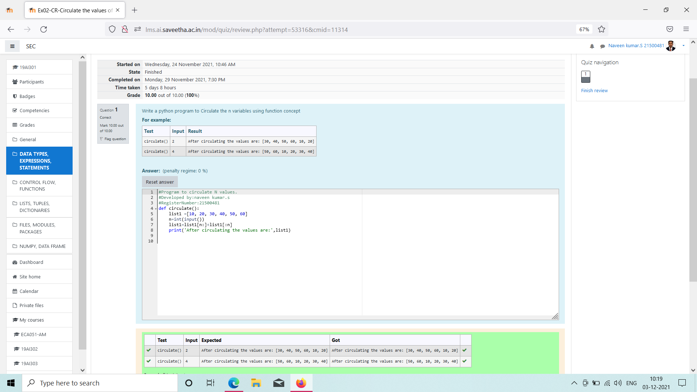

# Circulate-the-values-of-N-variables
## Aim:
To write a python program to circulate the n variables using function concept
## Equipment’s required:
PC
Anaconda - Python 3.7
## Algorithm: 
### Step 1: 
use the def function
### Step 2: 
create a list include from 10 to 60 and then make n as input
### Step 3: 
Get the value from the user for the number of rotation
### Step 4: 
Using the slicing concept rotate the list

### Step 5: 
print the list value 
### Step 6: 
End the Programme.
## Program:
~~~
def circulate():
    list1 =[10, 20, 30, 40, 50, 60]
    n=int(input())
    list1=list1[n:]+list1[:n]
    print('After circulating the values are:',list1)
~~~

## Output:

## Result:
       Hence the n-varibles are programmed.